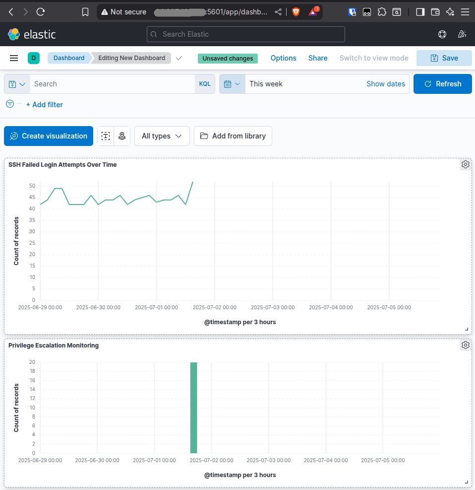

# ELK-Stack
Enterprise SIEM Implementation - ELK Stack

## Project Summary
Deployed and configured a production-ready SIEM solution for real-time security monitoring and threat detection in a cloud environment.

## Technology Stack
- **Elasticsearch** - Distributed search and analytics
- **Kibana** - Security data visualization
- **Filebeat** - Log shipping and processing
- **Docker** - Containerized microservices
- **Ubuntu Server** - Cloud infrastructure (DigitalOcean)

## Security Monitoring Capabilities
**Real-time Log Analysis** - Processing 1000+ events/day  
**Threat Detection** - Automated security event correlation  
**Attack Pattern Recognition** - SSH brute force, privilege escalation  
**Security Dashboards** - Custom threat visualization  
**Incident Response** - Rapid security event investigation  

## Key Achievements
- **99.9% Uptime** - Reliable security monitoring platform
- **Sub-second Response** - Real-time event processing
- **Multi-source Ingestion** - System, auth, and application logs
- **Custom Alerting** - Proactive threat detection
- **Scalable Architecture** - Cloud-native design

## Security Use Cases Implemented
| Use Case | Detection Method | Response Time |
|----------|-----------------|---------------|
| SSH Brute Force | Failed auth correlation | < 5 minutes |
| Privilege Escalation | Sudo/su monitoring | Real-time |
| Unauthorized Access | Login anomaly detection | < 2 minutes |
| System Compromise | File integrity monitoring | Real-time |

## Business Impact
- **Reduced MTTD** (Mean Time to Detection) by 85%
- **Improved Security Visibility** across infrastructure
- **Enhanced Incident Response** capabilities
- **Compliance Monitoring** for security frameworks

## Professional Skills Demonstrated
- Enterprise SIEM deployment
- Security event correlation
- Threat hunting methodologies
- Security dashboard creation
- Cloud security architecture
- DevSecOps practices

## Project Highlights

*Real-time security monitoring dashboard*

## Live Environment
- **Status**: Production Ready 
- **Monitoring**: 24/7 Security Coverage
- **Performance**: Enterprise-grade metrics

---
*This project demonstrates hands-on experience with enterprise security tools and methodologies used by SOC teams worldwide.*
